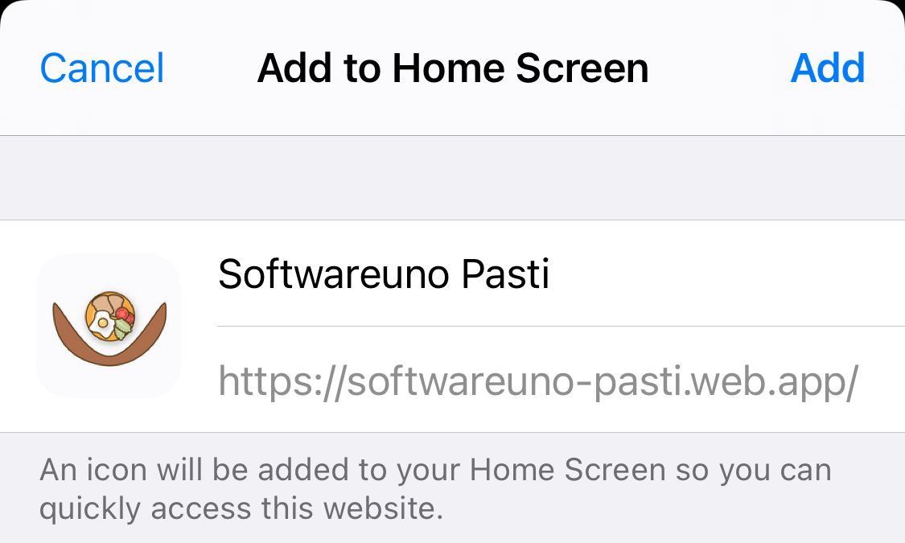

# Softwareuno Pasti
Applicazione per prenotare i pasti di Softwareuno
## Registrazione all'app
La registrazione può essere effettuata solo da un amministratore.\
Quando un utente viene creato, viene inviata una mail a quest'ultimo con un link per modificare la password (il link scade dopo 50 minuti).\
Nel caso in cui il link sia scaduto, andare nella pagina di [login dell'app](https://softwareuno-pasti.web.app/login) e cliccare su **DIMENTICATA?**.\
In questo modo riceverete una nuova mail per resettare la password.
## Accesso all'applicazione
All'applicazione si può accedere al seguente link [Softwareuno Pasti](https://softwareuno-pasti.web.app/). È possibile utilizzarla da qualunque dispositivo.
Inoltre si può salvare nella home di tablet e smartphones.
### Salvare in home Android
1. Accedere da Chrome [all'applicazione](https://softwareuno-pasti.web.app/).
2. Cliccare sul messaggio che apparirà a fondo pagina chiedendo di installare l'app.  
  
3. Cliccare su installa.  
  
4. Ora si può accedere all'app dal menù delle applicazioni.  
  
### Salvare in home iOS
1. Accedere da Safari [all'applicazione](https://softwareuno-pasti.web.app/).
2. Cliccare sull'icona di condivisione.  

  
3. Scendere nel menù e cliccare su "Aggiungi a Home".  
  
4. Cliccare in alto a destra su aggiungi.  
  
5. Ora si può accedere all'app dalla home del dispositivo.  
  

## Bug 
In caso di problematiche aprite una segnalazione sotto **"Issues"** in questa pagina Github.
